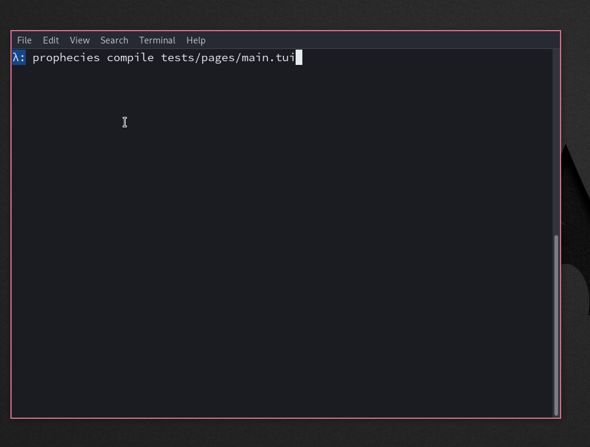

# Prophecies

Experimental HTML compiler into a curses backend application, using Parser Combinators.
Bringing the modern web-dev frameworks into TUIs.

It supports the most basic HTML tags, with no CSS.

# Trying it out

You can see some experiment examples in `tests/pages`:

The following is the most complete example (`tests/pages/main.tui`)
```html
<h1> Title </h1>
<p> This is paragraph and it has <b><blink> formatting </blink> with bolds and </b> blinks</p>
<p>We have ordered lists</p>
<ol>
	<li>Item 1</li>
	<li>Item 2</li>
</ol>
<br></br>
<hr></hr>
<br></br>
<p>We have unordered lists</p>
<ul>
	<li>Item 1</li>
	<li>Item 2</li>
</ul>
```

which compiles to 


